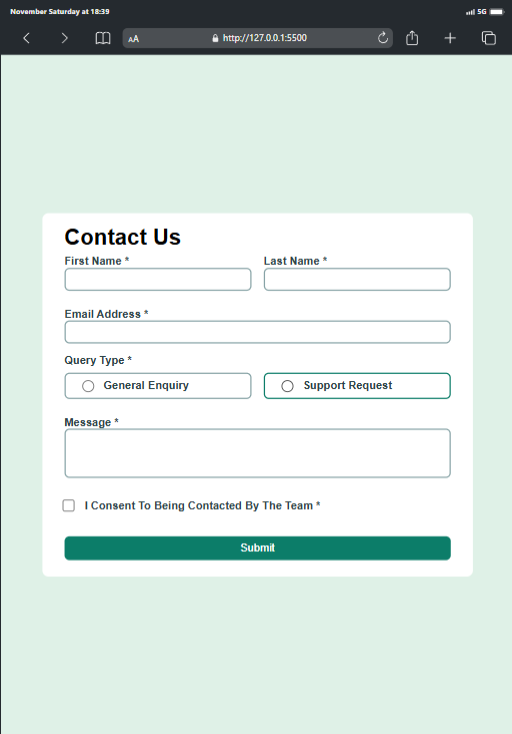

# Frontend Mentor - Contact form solution

This is a solution to the
[Contact form challenge on Frontend Mentor](https://www.frontendmentor.io/challenges/contact-form--G-hYlqKJj).
Frontend Mentor challenges help you improve your coding skills by building
realistic projects.

## Table of contents

- [Overview](#overview)
  - [The challenge](#the-challenge)
  - [Screenshot](#screenshot)
  - [Links](#links)
- [My process](#my-process)
  - [Built with](#built-with)
  - [What I learned](#what-i-learned)
  - [Continued development](#continued-development)
  - [Useful resources](#useful-resources)
- [Author](#author)
- [Acknowledgments](#acknowledgments)

## Overview

### The challenge

Users should be able to:

- Complete the form and see a success toast message upon successful submission
- Receive form validation messages if:
  - A required field has been missed
  - The email address is not formatted correctly
- Complete the form only using their keyboard
- Have inputs, error messages, and the success message announced on their screen
  reader
- View the optimal layout for the interface depending on their device's screen
  size
- See hover and focus states for all interactive elements on the page

### Screenshot





### Links

- Solution URL:
  [Solution on GitHub](https://github.com/Mubarak-Adeyemi/contact-form-main)
- Live Site URL:
  [Live Demo](https://mubarak-adeyemi.github.io/contact-form-main/)

## My process

### Built with

- Semantic HTML5 markup
- CSS custom properties for maintainable theming
- Flexbox for responsive layout
- Mobile-first workflow for progressive enhancement

### What I learned

In working on this project, I focused on creating a streamlined form validation
experience and improving code readability, performance, and reusability. Here
are some examples:

#### Form Validation Logic

One key part of this form’s validation logic is encapsulated in small, reusable
functions that keep the code organized and efficient. For example, displayError
and clearError functions centralize error handling, reducing redundancy:

```js
const displayError = (element, message) => {
  element.classList.add("show");
  element.textContent = message;
};

const clearError = (element) => {
  element.classList.remove("show");
  element.textContent = "";
};
```

#### Reusable Event Handling

By attaching event listeners to each input field, we ensured real-time
validation, improving the user experience:

```js
nameInputs.forEach((input, index) => {
  const errorElement =
    index === 0 ? errors.firstNameError : errors.lastNameError;
  input.addEventListener("input", () => validateName(input, errorElement));
});
```

This approach made the code modular and easy to extend if more fields are added.

### Continued development

I plan to explore:

- Form Validation Libraries: Testing popular form validation libraries (like
  Formik and Yup) to see how they handle validation rules more robustly,
  especially in React.

- Custom Animations: Experimenting with custom animations and transitions for
  success messages to enhance feedback to the user.

### Useful resources

- [MDN Web Docs](https://developer.mozilla.org/en-US/docs/Learn/Forms/Form_validation) -
  Comprehensive guide to form validation best practices.

- [A11Y Project](https://www.a11yproject.com/) - Helped me ensure the form was
  accessible and keyboard-navigable.

## Author

- Frontend Mentor -
  [Mubarak-Adeyemi](https://www.frontendmentor.io/profile/Mubarak-Adeyemi)
- Twitter - [@mubarakElarabiy](https://www.twitter.com/@mubarakElarabiy)

## Acknowledgments

A big thank you to ChatGPT for helping me troubleshoot and optimize the code for
this project, ensuring efficient and effective form validation. The guidance
provided was invaluable in improving the code’s readability, accessibility, and
overall performance.
